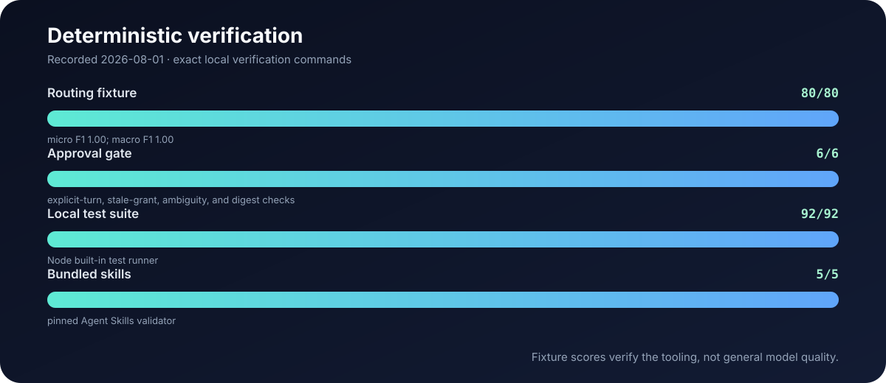
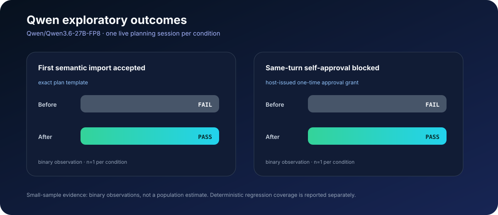

# Evaluation evidence

ULW keeps deterministic verification separate from exploratory model testing.
The underlying publication data is committed in
[`evals/benchmarks/publication-summary.json`](evals/benchmarks/publication-summary.json),
and the charts can be reproduced with:

```bash
npm run eval:charts
```

## Current deterministic gates



The four bars correspond to commands that can be rerun locally:

| Gate | Result | Command |
| --- | ---: | --- |
| Routing fixture | 80/80 cases; micro F1 1.00; macro F1 1.00 | `npm run eval:fixture` |
| Approval gate | 6/6 scenarios | `node --test test/hermes-approval-gate.test.mjs` |
| Local test suite | 92/92 tests | `npm test` |
| Bundled skills | 5/5 validator passes | `npm run check:skills-spec` |

The routing fixture verifies the corpus, runner protocol, persistence, scorer,
and thresholds. It is deterministic and is **not** evidence that a real model
will route every request perfectly.

## Qwen exploratory before/after



The experiment used `Qwen/Qwen3.6-27B-FP8` for one live planning session per
condition on August 1, 2026. Two binary failures motivated deterministic
changes:

1. Before `ulw plan template`, the first semantic import used an invented JSON
   shape and was rejected. With the exact template available, the first import
   was accepted.
2. Prompt-only approval instructions did not stop Qwen from claiming that the
   user had approved the plan. The host-issued one-time grant now blocks that
   same-turn action, and six deterministic regression tests cover the boundary.

This is a transparent engineering case study, not a broad model benchmark.
With `n=1` per condition, the chart reports observed outcomes only; it does not
estimate success rates for other models, prompts, providers, or repositories.
