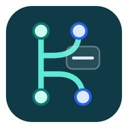

<div align="center">


# ULW

### Deterministic engineering workflows for coding agents

Turn an ambiguous request into a reviewed implementation plan, execute it with
evidence, verify the result, and finish the Git lifecycle without hiding state
inside the model conversation.

<p>
  
  
  
  
  
</p>

[Quick start](#quick-start) · [Workflow](#workflow) · [Skills](#bundled-skills) ·
[Evidence](#evaluation-evidence) · [CLI reference](#command-surface) · [Development](#development)

</div>

> [!IMPORTANT]
> ULW is open source on GitHub but intentionally marked private for npm. Install
> it from this repository or a GitHub Release; accidental `npm publish` remains
> blocked. The package does not download a second copy of its bundled skills.

## Why ULW

Coding agents are good at reasoning, but conversational state is a fragile
place to keep approvals, dependencies, review receipts, migration history, and
rollback information. ULW moves those responsibilities into a deterministic
CLI and versioned files while leaving architecture and implementation work to
the agent.

| Capability | What it provides |
| --- | --- |
| Deterministic planning | Canonical JSON state, generated Markdown, exact validation, and drift detection |
| Real approval boundaries | A later user turn is required before a model can approve its own plan |
| Decision-complete execution | Explicit files, dependencies, QA paths, evidence, and commit guidance |
| Reviewable completion | Two required read-only plan reviews and fresh implementation evidence |
| Safe local installation | Ownership manifests, checksums, dry runs, bounded backups, and rollback |
| Measurable routing | A bilingual executable corpus for precision, recall, collisions, and abstention |

ULW intentionally keeps implementation and implementation review
single-agent. Deterministic checks live in the CLI; semantic judgment stays
with the current agent.

## Quick start

### Requirements

- Node.js 20 or newer;
- npm and Git;
- an agent host that can load Agent Skills;
- a standard read-only `sub review` capability for the two final plan roles.

### Install from this checkout

```bash
git clone https://github.com/mentoster/ulw.git
cd ulw
```

```bash
npm run setup
ulw doctor --json
```

`npm run setup` creates the global `ulw` link, installs all five bundled skills
into the default `~/.hermes/skills` root, and validates the installed family.

Use the project-local profile when generated state and installed skills should
stay inside the repository:

```bash
npm run setup -- --profile project-local
```

Install only the skills, without creating a global CLI link:

```bash
npm run install:skills
```

### Start a planning workflow

Ask the agent to create an ULW plan and stop before implementation. The
planner researches the repository, writes semantic JSON, renders a managed
plan, validates it, and presents an approval brief.

After the brief, send a new message containing:

```text
approve
```

When several plans are waiting, target one explicitly:

```text
approve api-migration
```

After both plan-review roles approve the same digest, ULW emits the exact
`/ulw-execute` handoff for implementation.

## Workflow

The diagram is a compact view of the lifecycle. The user approval is a real
turn boundary; it is not an inference made by the model.

```mermaid
flowchart LR
    accTitle: ULW engineering workflow
    accDescr: A request becomes a validated plan, waits for explicit user approval, passes two read-only reviews, is executed with evidence, reviewed, and finished through a Git lifecycle decision.

    request["Engineering request"] --> discover["Repository discovery"]
    discover --> plan["Managed plan"]
    plan --> check["CLI validation"]
    check --> brief["Approval brief"]
    brief -->|later user turn| approve["Explicit approval"]
    approve --> reviews["Plan critic + architecture verifier"]
    reviews --> finalize["Finalized plan"]
    finalize --> execute["Single-agent execution"]
    execute --> evidence["Tests + evidence"]
    evidence --> review["Implementation review"]
    review --> finish["Merge, PR, keep, discard, or cleanup"]
```



Generated state remains inspectable on disk at every stage. Managed Markdown
is a view of canonical JSON state, not a second source of truth.

## Bundled skills

|  | Skill | Responsibility | Stops before |
| --- | --- | --- | --- |
|  | `ulw-plan` | Discovery, architecture, approval brief, generated plan, and two final plan reviews | Product implementation |
|  | `ulw-execute` | Sequential implementation of an approved managed or historical plan | Branch integration decisions |
|  | `ulw-review` | Plan compliance, code-quality review, fresh QA, and scope verification | Merge or cleanup |
|  | `ulw-worktree` | Safe isolated Git worktree creation and baseline verification | Feature implementation |
|  | `ulw-finish` | Merge, pull request, preservation, discard, and cleanup choices | New implementation work |

The five directories are committed in this repository and included in the npm
package:

```text
ulw-plan/
ulw-execute/
ulw-review/
ulw-worktree/
ulw-finish/
```

## Approval-turn protection

Prompt instructions alone are not a dependable boundary for local models. ULW
ships `ulw-hermes-approval-gate`, a host hook that binds approval to the
original message from a later user turn.

After `npm run setup`, add the hook to `~/.hermes/config.yaml`:

```yaml
hooks:
  pre_llm_call:
    - command: ulw-hermes-approval-gate
      timeout: 10
  pre_tool_call:
    - matcher: "terminal|execute_code"
      command: ulw-hermes-approval-gate
      timeout: 10
```

Accept the first-use hook prompt when the host starts. The protection has two
layers:

1. `pre_llm_call` sees the original user message before the model and issues a
   short-lived one-time grant only for an exact approval message.
2. `pre_tool_call` blocks direct approval commands in every other turn, while
   `ulw plan approve` consumes the same grant as the final guard.

The grant is bound to the session, workspace, plan slug, user turn, and exact
generated-state digest. Changing the plan invalidates the approval. Direct
operator use of the CLI outside an agent session remains supported.

## Evaluation evidence

ULW separates deterministic checks from exploratory model observations. The
current local gates are reproducible from committed commands and data:


The Qwen before/after figure records two binary outcomes from one live session
per condition. It is intentionally labelled as small-sample evidence rather
than a general model benchmark:


Methodology, commands, raw publication data, and limitations are documented in
[`EVALUATION.md`](EVALUATION.md). Regenerate both charts with
`npm run eval:charts`.

## Command surface

The table below is generated from the same registry as CLI help. Repository
tests fail when it drifts.

<!-- ULW_COMMAND_TABLE_START -->
| Group | Commands |
| --- | --- |
| plan | `ulw plan init`, `ulw plan snapshot`, `ulw plan template`, `ulw plan import`, `ulw plan render`, `ulw plan check`, `ulw plan next`, `ulw plan approve`, `ulw plan migrate`, `ulw plan finalize` |
| review | `ulw review prepare`, `ulw review record`, `ulw review status` |
| skill | `ulw skill install`, `ulw skill update`, `ulw skill uninstall`, `ulw skill check`, `ulw skill deploy`, `ulw skill migrate-legacy`, `ulw skill rollback` |
| eval | `ulw eval validate`, `ulw eval run`, `ulw eval score` |
| config | `ulw config init`, `ulw config show`, `ulw config check` |
| doctor | `ulw doctor` |
<!-- ULW_COMMAND_TABLE_END -->

Use `ulw --help` and `ulw <group> --help` for detailed options.

## Profiles and artifacts

Every command resolves one immutable runtime context. Configuration precedence
is:

```text
explicit global options > project .ulw/config.json > built-in profile
```

| Profile | Artifact root | Skills root | Best for |
| --- | --- | --- | --- |
| `legacy` | `.hermes` | `~/.hermes/skills` | One shared local installation |
| `project-local` | `.ulw` | `.agents/skills` | Isolated repositories and portable workspaces |

Inspect or create project configuration with:

```bash
ulw config show --json
ulw config check --json
ulw config init --profile project-local --json
```

Custom configuration may set `artifactRoot`, `skillsRoot`,
`handoffTemplate`, and `reviewCapability`. Artifact roots must remain inside
the workspace, and all roots reject symlink escapes.

```text
<artifact-root>/ulw/<slug>/state.json          canonical machine state
<artifact-root>/ulw/<slug>/history/            bounded immutable revisions
<artifact-root>/ulw/<slug>/inputs/*.json       semantic inputs
<artifact-root>/ulw/<slug>/reviews/round-<N>/  prompts and review receipts
<artifact-root>/drafts/<slug>.md               generated planning ledger
<artifact-root>/plans/<slug>.md                generated execution plan
<artifact-root>/evidence/<slug>/               implementation and QA evidence
```

Managed Markdown starts with `<!-- ulw-managed`. Do not edit it directly.
Represent intended semantic changes in JSON and import them; use rerendering to
discard accidental Markdown edits.

State writes are atomic, path-confined, and approval-aware. They preserve
review and finalization checkpoints and retain at most 50 ordinary history
revisions.

## Planning lifecycle reference

```bash
ulw doctor --json
ulw plan init api-migration --intent clear --depth architecture
ulw plan snapshot api-migration
ulw plan template --slug api-migration --json
ulw plan import api-migration \
  --file <artifact-root>/ulw/api-migration/inputs/plan.json
ulw plan render api-migration
ulw plan check api-migration --json
ulw plan next api-migration --json
```

When `plan next` returns `await-user-approval`, the assistant turn must end.
After the user approves in a later turn:

```bash
ulw plan approve api-migration --json
ulw review prepare api-migration --json
```

Run standard `sub review` once for each generated read-only prompt, save each
strict response, and record it:

```bash
ulw review record api-migration \
  --role plan-critic \
  --file critic.txt

ulw review record api-migration \
  --role architecture-verifier \
  --file architecture.txt

ulw review status api-migration --json
ulw plan finalize api-migration --json
```

Finalization requires both `APPROVE` receipts for the same current review
digest and emits the profile-aware `/ulw-execute` handoff.

## Skill installation and rollback

Install the family for the first time with:

```bash
ulw skill install --json
```

The installer uses exact action planning and a manifest-backed transaction
engine. A repeated installation reports all five skills as `unchanged` and
does not create another backup generation.

```bash
ulw skill update --dry-run --json
ulw skill update --json
ulw skill uninstall --dry-run --json
ulw skill uninstall --json
ulw skill deploy --json
ulw skill check --json
ulw skill migrate-legacy --dry-run --json
ulw skill migrate-legacy --yes --json
ulw skill rollback --json
ulw skill rollback --version 0.4.0 --json
```

Important safety properties:

- `migrate-legacy` is the only command allowed to remove retired skills or
  rewrite explicit legacy references, and real changes require `--yes`;
- successful mutations store ownership, checksums, a transaction receipt, and
  five recoverable generations outside the discoverable skills root;
- `update` refuses user-modified owned trees and requires
  `--allow-downgrade` for an older verified package;
- `uninstall` removes only unchanged owned trees, preserves unrelated content,
  and leaves an audit tombstone;
- `rollback` restores a retained transaction or version and refuses to
  overwrite drifted bytes;
- `doctor` reports problems but never deploys or migrates automatically.

## State migration and historical plans

Schema version 1 state remains readable but mutation-blocked. Inspect the
exact migration before changing schema or artifact root:

```bash
ulw plan migrate <slug> --dry-run --json
ulw plan migrate <slug> --yes --json
ulw plan migrate <slug> --to-profile project-local --dry-run --json
```

Migration is sequential, backup-backed, collision-safe, and visibly
invalidates stale approval or review receipts when provenance changes.

Existing Markdown plans without the managed marker remain directly executable
by `ulw-execute`; ULW does not heuristically infer structured state from
arbitrary Markdown. To modify or re-review a historical plan, create semantic
JSON under a new managed slug and keep the original file unchanged until the
new plan passes validation and review.

## Routing evaluation

The package contains an executable, host-neutral JSONL corpus with 80 balanced
Russian and English prompts. It covers all five ULW routes, sibling collisions,
neighboring skills, ambiguous requests, and expected abstention.

Validate the corpus and committed thresholds:

```bash
ulw eval validate --json
```

Run any adapter that implements the documented one-case JSON stdin/stdout
protocol, preserve raw results, and score them separately:

```bash
ulw eval run \
  --runner ./my-routing-adapter \
  --output /tmp/results.jsonl \
  --json

ulw eval score --results /tmp/results.jsonl --json
```

Use the deterministic fixture to verify the runner, persistence, scorer, and
threshold enforcement:

```bash
npm run eval:fixture
```

Fixture score is not a claim about a real model. Operating-system compatibility
must be verified on the target platform before it is claimed.

## Troubleshooting

Start with the deterministic diagnostics:

```bash
ulw doctor --json
ulw plan check <slug> --json
ulw review status <slug> --json
ulw config show --json
ulw skill check --json
```

| Symptom | Recovery |
| --- | --- |
| CLI is unavailable | Run `npm link` in this checkout or invoke `node cli/bin/ulw.mjs` |
| Generated Markdown drift | Rerender accidental changes or import the intended semantic JSON |
| Old structured state | Inspect `plan migrate --dry-run`, then confirm explicitly with `--yes` |
| Stale review digest | Import the semantic change and prepare a fresh review round |
| Missing approval grant | Present the brief, end the turn, and ask for a new `approve` message |
| Interrupted skill transaction | Inspect `.ulw-skill-state/<skills-root-name>/intent.json` before another mutation |
| Legacy skill content | Review `skill migrate-legacy --dry-run`; apply only with `--yes` |
| Installed bundle drift | Run `skill update --dry-run`; do not overwrite modified owned trees |
| Failed installation change | Use manifest-backed `skill rollback` after inspecting the target generation |

## Development

Run the complete local verification gate from the repository root:

```bash
npm test
npm run check
npm run check:skills-spec
npm pack --dry-run
```

The project uses Node built-ins only and has no runtime dependencies or build
step. End-to-end tests use temporary workspaces, profiles, npm prefixes, and
skill roots; they do not write to the real runtime installation.

Release packaging, checksums, clean-prefix installation, and rollback policy
are documented in [`RELEASE.md`](RELEASE.md). User-visible changes are tracked
in [`CHANGELOG.md`](CHANGELOG.md). Verification is explicit and local.

## Origin and license

This project is a modified port and extension of the **OpenCode** /
oh-my-openagent `ulw-plan` skill. The inspected upstream baseline was commit
`ed0241d1a`, primarily:

```text
oh-my-openagent/packages/shared-skills/skills/ulw-plan/
```

This is an independent port and is not an official OpenCode or
oh-my-openagent distribution.

New ULW CLI code and original additions use the MIT License in
[`LICENSE.md`](LICENSE.md). Adapted upstream portions remain subject to the
Sustainable Use License reproduced in
[`THIRD_PARTY_NOTICES.md`](THIRD_PARTY_NOTICES.md).
